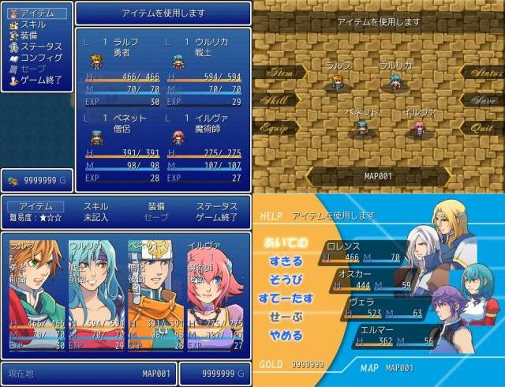

# カスタムメニュー

- スクリプトを組み合わせて、メニューを作り変えることができます。
- メニューコマンドの名称・配置を自由に変更できます。
- メニューコマンドの名称をゲーム中に変更できます。
- スイッチや変数を使用して、項目選択の可否を変更できます。
- メニューコマンドで、コモンイベントの呼び出しが行えます。
- ステータス項目を変更できます。

## スクリーンショット



※ 画像は開発中のものです。

## 導入の手順

カスタムメニューは、メニュー関連の処理を再定義しています。\
メニューを操作する処理が含まれるスクリプトでも、その処理を潰して実行させるため、カスタムメニューはできるだけ下のほうに導入してください。

現在、以下のスクリプトで正常に動作することを確認しています。

- コマンド設定例のスクリプト
- Custom Menu Canvas Plusのスクリプト

### ベーススクリプト

下記の２つのスクリプトを導入してください。

- [Custom Menu Base](CustomMenuBase.md)
  - メニュー全体とメニューコマンドの設定を行います。
  - 項目名や項目処理の設定は、このスクリプトで行います。
  - 項目処理の設定が分からない場合の設定例はこちら。
- [Custom Menu Canvas](CustomMenuCanvas.md)
  - メニューステータスの項目を描画するための機能が定義されています。
  - ※ Custom Menu Canvas Plus の方は、使用しない場合は必要ありません。

### メニューコマンド

どちらかのスクリプトを導入してください。

- [ウィンドウタイプ](https://github.com/cacao-soft/RMVX/raw/main/CustomMenu//CustomMenuCommandWindow.rb)
  - デフォルトのものと変わりません。
  - 凝ったことはできませんが、比較的簡単な設定で済みます。
- [スプライトタイプ](https://github.com/cacao-soft/RMVX/raw/main/CustomMenu//CustomMenuCommandSprite.rb)
  - 画像で表示するタイプです。
  - 通常時と選択時の画像を別に表示するため、ちょっとした動きも表現可能です。
  - 項目の画像\
    **通常時、選択時、禁止項目、禁止項目選択時**の順に並べて配置します。\
    

### メニューステータス

どちらかのスクリプトを導入してください。

- [ウィンドウタイプ](https://github.com/cacao-soft/RMVX/raw/main/CustomMenu//CustomMenuStatusWindow.rb)
  - １枚のウィンドウで表示します。
  - デフォルトのようなステータスとなります。
- [スプライトタイプ](https://github.com/cacao-soft/RMVX/raw/main/CustomMenu//CustomMenuStatusSprite.rb)
  - アクターごとに違うスプライトで表示します。
  - ウィンドウと違い背景となる画像を用意する必要があります。

### オプション

オプションは、お好みで追加してください。\
所持金ウィンドウなどもオプション追加が必要になります。

- [ヘルプウィンドウ](https://github.com/cacao-soft/RMVX/raw/main/CustomMenu/CustomMenuHelp.rb)
- [所持金ウィンドウ](https://github.com/cacao-soft/RMVX/raw/main/CustomMenu/CustomMenuGold.rb)
- [現在地ウィンドウ](https://github.com/cacao-soft/RMVX/raw/main/CustomMenu/CustomMenuLocation.rb)
- [プレイ時間ウィンドウ](https://github.com/cacao-soft/RMVX/raw/main/CustomMenu/CustomMenuPlayTime.rb)
- [隊列ウィンドウ](https://github.com/cacao-soft/RMVX/raw/main/CustomMenu/CustomMenuFormation.rb)
- [テキストウィンドウ](CustomMenuText.md)
- [立ち絵表示](https://github.com/cacao-soft/RMVX/raw/main/CustomMenu/CustomMenuActor.rb)
- [サブコマンドウィンドウ](CustomMenuSubCommand.md)

## よくある質問

カスタムメニューは、ベース・コマンド・ステータス・オプションの４種のスクリプトから成ります。\
各スクリプトは、それ単体では動作しませんので、導入手順を確認して必要なスクリプトすべてを導入してください。

### Ｑ．ゲーム開始時やメニューを開くとエラーが出る

以下のようなエラーの場合は、導入の手順をご確認ください。

```text
スクリプト ' ' の - 行目で NameError が発生しました。
uninitialized constant CAO::CM
```

CustomMenu Base のスクリプトが導入されていない可能性があります。\
動作に必要なスクリプトがすべて入っているか確認してください。

```text
スクリプト ' ' の - 行目で NameError が発生しました。
uninitialized constant CAO::CM::Canvas
```

CustomMenu Canvas のスクリプトが導入されていない可能性があります。\
動作に必要なスクリプトがすべて入っているか確認してください。

```text
スクリプト ' ' の - 行目で NameError が発生しました。
undefined local variable or method `create_command_window' for #<Scene_Menu>
```

```text
スクリプト ' ' の - 行目で NameError が発生しました。
undefined local variable or method `update_command_window' for #<Scene_Menu>
```

メニューコマンドのスクリプトが導入されていない可能性があります。\
動作に必要なスクリプトがすべて入っているか確認してください。

```text
スクリプト ' ' の - 行目で NameError が発生しました。
undefined local variable or method `create_status_window' for #<Scene_Menu>
```

```text
スクリプト ' ' の - 行目で NameError が発生しました。
undefined local variable or method `update_status_window' for #<Scene_Menu>
```

メニューステータスのスクリプトが導入されていない可能性があります。\
動作に必要なスクリプトがすべて入っているか確認してください。

### Ｑ．メニューにヘルプウィンドウを表示させたくて、ヘルプウィンドウを導入しましたがうまくいかない

ヘルプウィンドウは、カスタムメニューのパーツですので、それ単体では動作しません。\
カスタムメニューの必須スクリプトをすべて導入したうえで、ヘルプウィンドウを導入してください。

### Ｑ．コマンドウィンドウの文字サイズを変更してもウィンドウのサイズが小さくならない

仕様です。
文字サイズは小さくなりますが、行幅に変化はないのでウィンドウのサイズは変わりません。

### Ｑ．コマンドウィンドウの文字サイズを大きくすると、文字が切れる

仕様です。
文字サイズは大きくなりますが、行幅は変更されないので 24 より大きい文字の場合切れてしまいます。

### Ｑ．戦闘不能アクターの顔グラが薄くなる

Custom Menu Canvas の「戦闘不能アクターの顔グラの不透明度」という設定を 255 にしてみてください。

### Ｑ．メニューステータスの項目で縁取りや画像使用のスクリプトが反映されない

ステータスウィンドウの場合は、項目の識別子に w_ を加えることで、反映させられる場合があります。\
ステータススプライトの場合は非対応です。

### Ｑ．メニュー項目で、ある値を変更したいがメニューに反映されない

その値を使用しているウィンドウを再描画する必要があります。\
詳細は、Custom Menu Base の「項目処理」の説明をご覧ください。

### Ｑ．使用できない項目を選択禁止ではなく、非表示にしたい

申し訳ありません。そのような機能はありません。

### Ｑ．メニューステータスを非表示にしたい

ウィンドウの位置を画面外に設定するか、表示する項目の設定をカラにしてウィンドウ背景を非表示にしてみてください。
