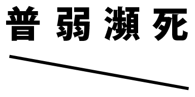

# Custom Menu Canvas

- 描画のためのメソッドが定義されています。
- 主にステータス項目を描画する際に使用されます。

## ダウンロード

- [Custom Menu Canvas](https://github.com/cacao-soft/RMVX/raw/main/CustomMenu/CustomMenuCanvas.rb)
- [Custom Menu Canvas Plus](https://github.com/cacao-soft/RMVX/raw/main/CustomMenu/CustomMenuCanvasPlus.rb)
  ※ 他サイト対応

## 設定項目

### EXPRESSION_FACE

```ruby
EXPRESSION_FACE = false
```

残りＨＰで顔グラを変化させるかを設定します。
変化させる場合は、true変化させない場合は、falseを設定します。
この設定をtrueにした場合は、ステータスでの顔グラすべてに表情が適用されます。

表情グラを使用する場合は、顔グラのファイルを編集する必要があります。



画像のように１アクター１ファイルにする必要があります。
データベースなどの通常時の顔グラは、左上の部分を選択します。
この位置は、固定となります。下段の画像については、制限はありません。

画像は、あくまで一例です。
SWITCH_EXPRESSION の設定によって位置がずれます。
> SWITCH_EXPRESSION = [50, 0]：２つ目の画像がＨＰ半分以下、３つ目が戦闘不能
> SWITCH_EXPRESSION = [0]：２つ目の画像が戦闘不能の画像

### SWITCH_EXPRESSION

```ruby
SWITCH_EXPRESSION = [50, 30, 0]
```

最大３要素の配列で設定します。
100以下、第１要素以下、第２以下、第３以下のように４つ画像が設定できます。
ＨＰが100%の場合のみの画像を設定する場合は、第１要素に99を入れます。
戦闘不能の場合のみの画像を設定する場合は、最後の要素に0を入れてください。

### DIDE_FACE_OPACITY

DIDE_FACE_OPACITY = 128
戦闘不能アクターの顔グラの不透明度を設定します。
戦闘不能でも変化させない場合は、255 に設定します。
※ この不透明度は、通常の顔グラと表情ありの両方に適用されます。

### MENU_FACE_NAME

MENU_FACE_NAME = ["MActor", "%s%d"]
立ち絵のファイル名の形式を設定します。
["MActor", "%s%d"]
配列の第１要素は、ファイル名に含まれる文字列でです。
第２要素で、各文字の配置を設定します。
制御文字として、%sと%dの２つが使用できます。
制御文字は、%s%d%dの順に３つまで仕様でます。
１つ目 %s は、配列の第１要素で設定した文字列
２つ目 %d は、アクターのＩＤ
３つ目 %d は、識別番号をあらわします。

> 例）\
> ["MActor", "%s%d"] "MActor1"\
> ["MActor", "%s%d-%d"] "MActor3-0"

※ 制御文字を３つ使用した場合の初期識別番号は、0 です。

### 各文字色

文字やゲージの色を変更したい場合は、色設定の部分の
text_color(☆) 星部分を変更してください。
この数値は、ウィンドウスキン画像の右下にある色の番号で指定されています。
左上の０で始まり横に１、２と続きます。

## 描画項目の指定

### [param, x, y, option1, option2]

#### param

描画項目

|param||param||
|-|-|-|-|
|:name|名前を描画|:level|レベルを描画|
|:class|クラスを描画|:state|ステートを描画|
|:hp|ＨＰゲージを描画|:mp|ＭＰゲージを描画|
|:exp|経験値ゲージを描画|:face|顔グラを描画|
|:chara|歩行グラを描画|:walk|歩行グラを描画 (足踏み)|
|:body|立ち絵の描画|:position|隊列の位置を描画|
|:level_g|レベルの描画 (経験値ゲージ付)|||

#### x, y

描画する座標

#### option1

- paramが **:name, :level, :class, :state, :hp, :mp, :exp, :position** のとき
  - 横幅 (省略時は、120)
- paramが **:face** のとき
  - 顔グラの大きさ (省略時は、96)
  - 数値ではなく配列で [width, height] と指定すると、それぞれ違う長さで設定できます。
- paramが **:chara, :walk** のとき
  - 足元を基点に描画するか (省略時は、false 左上を基点とする)

#### option2

- paramが **:name, :level, :class, :position** のとき
  - 文字位置(0..左揃え、1..中央揃え、2..右揃え)

## 描画項目の指定（ウィンドウタイプ）

Window_Base クラスに定義されているメソッドを使用して描画します。
ゲージなどに画像を使うなど再定義された項目を描画する際に使用します。\
先頭に w_ の付いていないものは、カスタムメニュー独自の描画を行います。

|param||param||
|-|-|-|-|
|:w_name|名前を描画|:w_level|レベルを描画|
|:w_class|クラスを描画|:w_state|ステートを描画|
|:w_hp|ＨＰゲージを描画|:w_mp|ＭＰゲージを描画|
|:w_face|顔グラを描画|:w_chara|歩行グラを描画|

以下の項目は、デフォルトでは定義されていません。\
ＣＢＳやＫＧＣさんの汎用ゲージ描画などを導入してください。

|param||param||
|-|-|-|-|
|:w_exp|経験値を描画|:w_position|隊列の位置を描画|

## 描画項目の指定（拡張）

下記の項目の描画には、拡張スクリプトが必要です。

### :od

```text
[:od, x, y, width = 120]
```

ＫＧＣさんのオーバードライブゲージを描画します。

### :name_od

```text
[:name_od, x, y, width = 120]
```

ＫＧＣさんのオーバードライブゲージをバックに名前を描画します。
