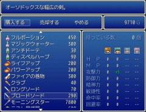
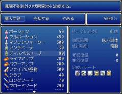
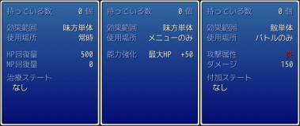
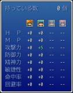
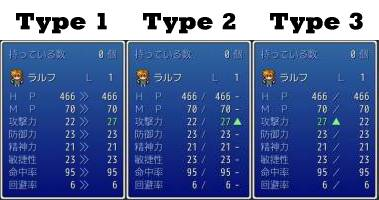
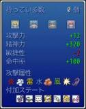
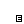

# カスタムショップステータス

ショップステータスの内容を拡張します。

## スクリーンショット




※ 画像は開発中のものです。

## スクリプト

- [ダウンロード](https://raw.githubusercontent.com/cacao-soft/RMVX/main/CustomShopStatus/CustomShopStatus.rb)

## 拡張スクリプト

表示内容を変更するためのものなので、必ずしも導入する必要はありません。導入する場合は、本体より下に導入してください。テキストまたは画像をクリックするとスクリプトが表示されます。

### アイテム
- [IA] [装備アイテム時の内容を表示](https://raw.githubusercontent.com/cacao-soft/RMVX/main/CustomShopStatus/css_ia.rb)
※ 装備の拡張スクリプトを入れていない場合は表示されません。
- [IB] アイテムの性能を表示
[](https://raw.githubusercontent.com/cacao-soft/RMVX/main/CustomShopStatus/css_ib.rb)

### 装備
- [EA] アクターを４人ずつ表示するタイプ
[](https://raw.githubusercontent.com/cacao-soft/RMVX/main/CustomShopStatus/css_ea.rb)
- [EB] アクター１人のみ表示するタイプ(左右キーで切り替え)
[](https://raw.githubusercontent.com/cacao-soft/RMVX/main/CustomShopStatus/css_ea.rb)
- [EC] アイテムの性能を表示
[](https://raw.githubusercontent.com/cacao-soft/RMVX/main/CustomShopStatus/css_ea.rb)

## 使用準備

### アクターアイコン

**※ 画像を使用しない設定の場合は必要ありません。**
Graphics/System フォルダに保存してください。
１アクターのサイズは、24x24 で、横に８個並べた横幅 192px の画像です。
縦幅に制限はありませんので、アクターの数だけ追加してください。
左上のアイコンが１番のアクターで始まり横へ増えていきます。

### 装備済みマーク

**※ 画像を使用しない設定の場合は必要ありません。**
Graphics/System フォルダに保存してください。
サイズに制限はありませんが、中央に寄せられるので偶数値が良いと思います。



### スクリプトの併用

ステータス部分の変更が加えられるスクリプトとは併用できません。ショップ処理が大幅に改変されているものでも、ステータス部分に変更がなければ併用できる場合があります。

- 併用可能
  - 当サイト『装備可能クラス表示』
    本スクリプトより下に導入してください。
  - KAMESOFT さん『装備拡張 2009/08/18』『多人数パーティ 2009/11/01』
    本スクリプトより上に導入してください。
    多人数パーティでは、スクロール機能が使用できなくなります。

- 併用不可能
  - 当サイト『＜拡張＞ ショップステータス』『＜拡張＞ ショップステータス #2』『ショップコメント』

## 設定項目

※ ここでの設定は、拡張スクリプトによっては使用されないものも含まれます。

### 表示するパラメータ

```ruby
PARAMS = [:maxhp, :maxmp, :atk, :def, :spi, :agi, :hit, :eva, :cri, :odds]
```
基本的なパラメータです。
```
:atk   .. 攻撃力     :def   .. 防御力     :spi   .. 精神力
:agi   .. 敏捷性     :hit   .. 命中率     :eva   .. 回避率
```
特に必要ではないと思いますが、拡張された場合などに。
```
:maxhp .. 最大ＨＰ             :maxmp .. 最大ＭＰ
:cri   .. クリティカル率        :odds  .. 狙われやすさ
```
以下のパラメータは、拡張スクリプト必須です。デフォルトでは表示できません。
Game_Actor のオブジェクトから参照可能なパラメータは、おそらく表示できます。

```
:mdef  .. 魔法防御 (回想領域さんの『魔法防御パラメーター追加』にて動作確認済)
```

### 表示する属性とステートの設定

```ruby
USABLE_ELEMENTS = Array(9..16)          # 属性
USABLE_STATES   = Array(2..8)           # ステート
```
表示する属性およびステートのＩＤを配列で設定します。
例）Array(2..8) .. ２～８番　　　[1, 3, 4, 12] .. 1, 3, 4, 12番

### 属性のアイコン・色の設定

```ruby
ICON_ELEMENTS = {}
ICON_ELEMENTS["炎"]   = Color.new(230, 30, 30)
ICON_ELEMENTS["冷気"] = 105
ICON_ELEMENTS["雷"]   = Color.new(255, 230, 0)
ICON_ELEMENTS["水"]   = Color.new(100, 180, 255)
ICON_ELEMENTS["大地"] = 108
ICON_ELEMENTS["風"]   = Color.new(120, 200, 60)
ICON_ELEMENTS["神聖"] = 110
ICON_ELEMENTS["暗黒"] = 111
```
数値で設定するとアイコンで表示します。
カラーで設定すると、属性名をその色で描画します。
未設定の属性は、基本色(normal_color)で属性名を描画します。

### グループ設定

```ruby
GROUP_ELEMENTS = {}
GROUP_STATES = {}
```
属性・ステートのリストが一致した場合、アイコンの代わりにグループ名を表示します。
`GROUP_ELEMENTS[IDリスト] = "グループ名"`

※ IDリストは、配列ですので、[[1,2]] のように括弧が重複します。

### 文字色の設定

```ruby
COLOR_PUP   = Color.new(0, 255, 0)      # パワーアップ
COLOR_PDOWN = 11                        # パワーダウン
```
```
nil   .. 色を変更しない。(デフォルトの色を使用)
Color .. Color オブジェクトで指定
数値  .. ウィンドウスキンの文字色セットを使用
```

### アイコンの表示数

アイコンの表示数を 1 ～ 8 の数値で設定してください。

※ 7 以下だと左寄せの場合に左側に空白が入ります。

### アイテムの種類ごとの表示内容

```ruby
ITEM_PARAMS["NONE"]     = []
ITEM_PARAMS["RECOVERY"] = [:recovery, :minus_state]
ITEM_PARAMS["GROWTH"]   = [:growth]
ITEM_PARAMS["ATTACK"]   = [:element, :damage, :plus_state]
```
アイテムのメモ欄に`<SHOP_○○>`と記述することで種類を設定でき、表示内容を変更することができます。(例：<SHOP_RECOVERY>)
メモ欄を使用しなかった場合は、自動判定(NONE,RECOVERY,GROWTH,ATTACK)となります。
```
NONE     .. デフォルトの設定 以下の設定やメモ欄の設定もない。(<SHOP_NONE>)
ATTACK   .. 基本ダメージが設定されている。(<SHOP_ATTACK>)
GROWTH   .. 成長効果が設定されている。(<SHOP_GROWTH>)
RECOVERY .. HP,MPいずれかの回復効果が設定されている。(<SHOP_RECOVERY>)
```
表示可能な項目は以下の通りです。
```
:recovery    .. 回復効果          :growth      .. 成長効果
:minus_state .. 解除ステート       :plus_state  .. 付加ステート
:element     .. 属性              :damage      .. 基本ダメージ
:space       .. 一行あける
```