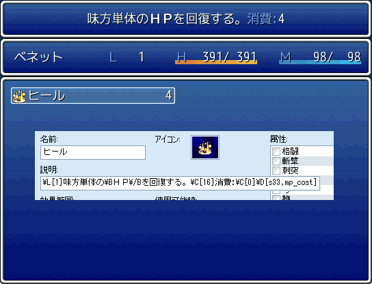

# ＜拡張＞ ヘルプウィンドウ

- ヘルプウィンドウに制御文字を追加します。

## スクリーンショット

※ 画像は開発中のものです。

## スクリプト

- [ダウンロード](https://raw.githubusercontent.com/cacao-soft/RMVX/main/ExHelp.rb)

## 使用方法

- スクリプト内の説明をご覧ください。

|制御文字|引数|説明|例|
|:-:|-|-|-|
|`\L[n]`|n: (0)左寄せ,(1)中央寄せ,(2)右寄せ|文字位置の指定。テキストの先頭で指定します。|`\L[1]`|
|`\U[n] ... \/U`|n: 下線の太さ|囲まれた文字に下線を引く|`\U[1]あいうえお\/U`|
|`\N[0]`||パーティ名||
|`\N[n]`|n: アクターID|アクター名|`\N[1]`|
|`\I[n]`|n: アイコンID|アイコン|`\I[12]`|
|`\F[フォーマット,引数]`||sprintf|`\F[%03d,12]`|
|`\S[テキスト,句点]`~||頭文字の反復|`\S[いろは]`|
|`$[...]$`||囲まれたテキストをスクリプトとみなし実行|`$[$game_variables[1]]$`|
