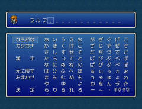
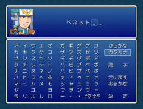

# ＜拡張＞ 名前入力の処理

- ひらがな・カタカナのほかに自分で定義した文字を使用できます。
- 漢字入力が可能になります。
- イベント変数へ代入することも可能です。
- ランダムネーム機能を追加しました。

## スクリーンショット




※ 画像は開発中のものです。

## スクリプト

- 本体 [ダウンロード](https://raw.githubusercontent.com/cacao-soft/RMVX/main/ExName2.rb)
- 設定 [ダウンロード](https://raw.githubusercontent.com/cacao-soft/RMVX/main/ExName2_config.rb)
- 拡張 [ダウンロード](https://raw.githubusercontent.com/cacao-soft/RMVX/main/ExName2_multi.rb) マルチインプット

## 文字種定義

|種類|スクリプト|説明|
|:-|:-:|:-|
|常用漢字Ａ|[ダウンロード](https://raw.githubusercontent.com/cacao-soft/RMVX/main/niKanji1.rb)|漢字のみ|
|常用漢字Ａ|[ダウンロード](https://raw.githubusercontent.com/cacao-soft/RMVX/main/niKanji1.rb)|ひらがな付き|
|全角英数|[ダウンロード](https://raw.githubusercontent.com/cacao-soft/RMVX/main/niEisu.rb)||
|半角英数|[ダウンロード](https://raw.githubusercontent.com/cacao-soft/RMVX/main/niHalfEisu.rb)||
|半角カタカナ|[ダウンロード](https://raw.githubusercontent.com/cacao-soft/RMVX/main/niHalfKana.rb)|マルチインプット導入必須|

## 必須事項

### 導入場所

- 実行には、「本体」「設定項目」の２つのスクリプトが必要となります。
- 導入する順番としては、「本体」「設定項目」「文字種定義」と設置してください。

### 文字種の定義

> **※ 別途文字を使用しない場合は必要ありません。**<br>
> ※ こちらの定義文は、文字種定義と同じものです。独自の定義を作成したい場合に参考にしてください。

スクリプト本体より下へ下記のスクリプトを加えてください。

```ruby
class Window_NameEdit < Window_Base
  TABLE_NAME = [ '', '', '', '', '',  '', '', '', '', '' ]
  TABLE << TABLE_NAME
end
```

- TABLE_NAME ： 文字グループの名前です。こちらの定数名は、変更してください。
- TABLE ： この定数名は変更しないでください。

１要素１文字で記述してください。定義できる数に制限はありませんが、配列の要素数は１０の倍数でなければなりません。

特殊な文字として、「 」「　」「BS」があります。
この文字は、表示される際に「半空」「全空」「消去」の文字に置き換えられます。
BSは、さらに文字を入力せずに１文字削除する機能を有します。

## 設定項目

### 空白挿入時に挿入する文字

```rb
ADD_SPACE = "　"
```
メニューやショートカットの空白挿入時に使用される文字です。

### 入力文字の中央揃え

```rb
EDIT_NAME_CENTER = true
```
一番上のアクターの名前が表示されるウィンドウの文字位置です。 

### 漢字モード時のひらがなの色

文字種定義の「常用漢字 タイプＢ」を使用した際に表示される左上のひらがなの色を設定します。

> 例）<br>
> COLOR_KEY_HIRAGANA = 0 # デフォでは白<br>
> COLOR_KEY_HIRAGANA = Color.new(255, 0, 0) # 赤

### オプションの項目

```rb
COMMAND_OPTIONS = [10, 11, nil, 12, nil, 4, 5, nil, 0]
```

- 必ず９項目で設定します。
- `nil`で、空白を作ります。
- それぞれの数値は、`TEXT_CMD_OPTION`で設定してあるものです。
  0～9 までの数値には、それぞれ処理が割り当てられていますので、変更することはできません。
  10～ が文字種を割り当てる番号となります。
  デフォルトで、10,11にはすでに文字種が設定されているので、変更はできません。
  ※ ただし、文字種定義を移動・削除すれば、数値も変更することができます。
- 数字は必ず連番で設定します。
  例えば、文字種定義の漢字を１つ追加すると、漢字の番号は 12 となります。
  漢字の項目を追加したい場所に、12と記述すると漢字の選択項目が表示されます。 

### オプションの項目名

メニューの項目名を変更できます。こちらで設定されている数値が、先ほどの`COMMAND_OPTIONS`で使用する数値となります。


文字種定義「漢字」を１つ追加したとすると、漢字は12に割り当てられます。
ですので、11 => "カタカナ"の横に,を追加して、その下に12 => "漢　　字"と記述します。
さらに、英数を１つ追加した場合は、次の番号13となりますので、同じように項目名を追加します。  

## 使用方法

### 名前入力を起動（イベント）

イベントコマンド「名前入力の処理」を実行してください。

このときにの設定は、以下の通りです。
 1. アクターの名前を変更
 1. 歩行グラを表示
 1. 無記入での終了を不許可

### 名前入力を起動（ラベル）

```ruby
 Ａ名前入力：アクターＩＤ[, 最大文字数][, キャラ画像の有無(o|x)]
```

キャラ画像の有無を省略した場合は、歩行グラ・顔グラを表示します。最大文字数は、１６文字までです。
最大文字数を省略した場合は、`DEFAULT_NAME_NUM`の値となります。
> 例）Ａ名前入力：1, 4, x 

### 文字入力を起動（ラベル）

```ruby
Ｖ文字入力：変数番号[, 最大文字数]
```

歩行グラ・顔グラは、表示できません。最大文字数は、１６文字までです。
最大文字数を省略した場合は、`DEFAULT_VAR_NUM`の値となります。

> 例）Ｖ文字入力：1, 16

### その他、スクリプト

通常、下記のスクリプトを実行する必要はありません。

|処理内容|スクリプト|
|:-|:-|
|▼ 名前入力処理の予約（処理の実行）|$game_temp.next_scene = "name"|
|▼ アクターまたは、変数のＩＤ|$game_temp.name_actor_id = n|
|▼ 最大文字数|$game_temp.name_max_char = n|
|▼ 入力モード|$game_temp.name_type = :actor<br>$game_temp.name_type = :variable|
|▼ 歩行グラを非表示|$game_temp.name_walk = false|
|▼ 無記入での終了を許可<br>※ 入力処理終了後、初期化されます。|$game_temp.name_nothing = true|
