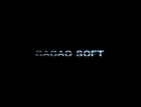

# オープニングロゴ

現在のゲーム画面を画像保存します。

## スクリーンショット



※ 画像は開発中のものです。

## スクリプト

- [ダウンロード](https://raw.githubusercontent.com/cacao-soft/RMVX/main/Logo.rb)

## 使用準備

### ロゴ画像

ピクチャのフォルダに保存してください。画像サイズに制限はなく、中央に表示されます。

### トランジション画像

- 保存フォルダ
  - Graphics/Pictures
  - 設定項目で変更可能
- サイズ
  - ゲーム画面と同じ大きさ

※ Transitions フォルダを使用する場合は、新規で作成してください。

## 設定項目

### ロゴ表示設定

```ruby
FRAMES = [
  ["tkool", 40, "fadein", 40, "fadeout", 40],
  ["logo", 40, "", 40, nil, 0, "Saint6"],
]
```

最低でも以下のように６つの設定を行う必要があります。
ファイル名, 時間 のセットをロゴとフェードインとフェードアウトの３つ。
`["ロゴ", 表示時間, "フェードイン", 掛ける時間, "フェードアウト", 掛ける時間]`
フェードイン、フェードアウト時にトランジション効果を使用しない場合は、文字列(ファイル名)を空にしてください。
また、フェードアウト(第５要素)のみ nil にするとフェードアウトを行わない処理になります。

第７要素から**"効果音", 音量, ピッチ**というように追加できます。
効果音の設定は省略することができます。
省略時の初期値は、効果音は演奏なし、音量は 80 、ピッチは 100 となります。
この効果音は、フェードイン開始前に演奏されます。

### トランジション画像の保存フォルダ

```ruby
DIR_TRANSITION = 0
```

この値を`0`にするとピクチャのフォルダに`1`にするとトランジションのフォルダにトランジション画像を保存してください。
トランジションフォルダは、ご自身で Graphics 内に作成していただく必要があります。

この設定に関係なくロゴ画像は、ピクチャのフォルダに保存してください。

### ロゴ間のウェイト

```ruby
WAIT = 10
```

ロゴを表示後の待ち時間です。

### テストプレイ時のロゴ表示の有無

```ruby
TEST_LOGO = false
```

`true`でテストプレイ時でもロゴを表示します。`false`では表示しません。

### ソフトリセット時のロゴ表示の有無

```ruby
RESET_LOGO = false
```

`true`でソフトリセット時でもロゴを表示します。`false`では表示しません。

※ ソフトリセットは F12 で行います。
