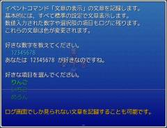

# メッセージログ

「文章の表示」で表示された文を記録・確認する機能を追加します。

## スクリーンショット



※ 画像は開発中のものです。

## スクリプト

- [ダウンロード](https://raw.githubusercontent.com/cacao-soft/RMVX/main/MessageLog.rb)

## 使用準備

### ベーススクリプト

注釈命令を使用する場合に [Interpreter 108 EX](https://raw.githubusercontent.com/cacao-soft/RMVX/main/Ex108i.rb) が必要になります。

## 拡張機能

### 操作方法の表示

- [ダウンロード](https://raw.githubusercontent.com/cacao-soft/RMVX/main/MessageLogInfo.rb)

メッセージウィンドウとログウィンドウが表示されている場合にのみ表示されます。
文字が表示されていなくてもマップ上のどこでもログ確認ができることに変わりありません。
また、ログ非表示スイッチがＯＮになっている場合は、文字は表示されません。

### 背景画像の使用

- [ダウンロード](https://raw.githubusercontent.com/cacao-soft/RMVX/main/MessageLogBack.rb)

ウィンドウ枠は自動で非表示になります。
また、ログ画面を開閉するときのウィンドウのアニメーションも無効となります。
操作方法の表示と併用可能です。

## 設定項目

### ログ記録の禁止スイッチの番号

```
OFF_SW_NUM = 5
```
こちらに設定した番号のスイッチをＯＮにすると、その間ログに残しません。

### ログ表示の禁止スイッチの番号

```
DISABLE_SW_NUM = 6
```
こちらに設定した番号のスイッチをＯＮにすると、その間ログを表示しません。

### 記録する行数

```
MAX_LOG = 100
```
ログ表示では一度に描画するのであまり大きくしすぎると表示が重くなります。
また、ログはセーブファイルに記録されるので、セーブファイルのサイズが大きくなります。

### 除外文字

```
EXCEPTS_TEXT = []
```
こちらで設定された文字はログに記録されません。
文字列だけでなく正規表現も使用できるので、制御文字がログに表示されてしまう場合などに設定してください。

### ログを表示するボタン
```
SHOW_BUTTON = Input::Y
```
ログはマップ上であれば、この設定のボタンでいつでも表示できます。
他には、Input::A, Input::X, Input::Y, Input::Z などがあります。
最後のアルファベットがボタン名と同じです。
ボタンとキーの関係は、ヘルプの「ゲームの操作方法」などでご確認ください。
