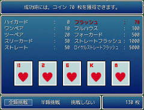
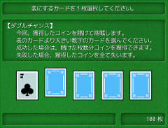
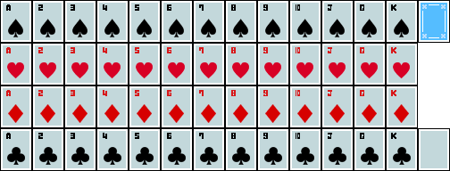

# ポーカー

ポーカーの機能を追加します。

## スクリーンショット




※ 画像は開発中のものです。

## ダウンロード

- [スクリプトファイル](https://github.com/cacao-soft/RMVX/raw/main/Poker.rb)

\


## 設定項目

### コインの配当

```
POKER_WINNING = [0, 1, 2, 3, 5, 7, 10, 50, 100, 500]
```

役を揃えたときの獲得コインの倍率です。
ハイカード（ブタ）～ロイヤルストレートフラッシュという順番です。
プレイ開始時に賭けたコインの○倍が返ります。\
※ ハイカードの数値は0で固定です。変更しないでください。

## ルール・仕様

1. 賭けコインの枚数を決める。
2. ５枚のカードから交換するカードを好きな枚数選び裏返す。（交換するカードは、０枚でもかまいません。）
3. 新しいカードを加え、手札に役ができていれば、その役のレートに従いコインを獲得します。
4. 役が揃っていた場合は、Ｗチャンスに挑戦できます。
Ｗチャンスでは、獲得したコインと同じ枚数を入手することができます。
表の数字より裏返した数字が大きければチャレンジ成功です。
(記号に関しては、A(1), J(11), Q(12), K(13) となります。)
成功すれば、さらに挑戦でき最大３回、
獲得コインで言えば最大４倍まで増やすことができます。
ただし、挑戦中に１度でも失敗すれば、獲得コインはすべて没収となります。

## 役

|役名|説明|
|-|-|
|ハイカード|役なし|
|ワンペア|同じ数字が２枚揃ったもの|
|ツーペア|ワンペアが２つできたもの|
|スリーカード|同じ数字が３枚揃ったもの|
|ストレート|[3/4/5/6/7]など５枚の数字が順番になったもの|
|フラッシュ|すべて同じマーク|
|ルハウス|ワンペアでかつスリーカード|
|ォーカード|同じ数字が４枚揃ったもの|
|トレートフラッシュ|ストレートでかつフラッシュのもの|
|イヤルストレートフラッシュ|[10/J/Q/K/A]のストレートでかつフラッシュのもの|
