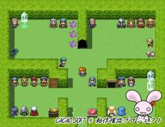
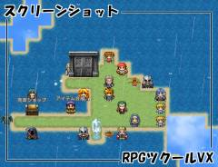

# スクリーンショット

現在のゲーム画面を画像保存します。

## スクリーンショット




※ 画像は開発中のものです。

## ダウンロード

- [スクリプトファイル](https://raw.githubusercontent.com/cacao-soft/RMVX/main/ScreenShot.rb)

## 使用準備

### ベーススクリプト

- [Bitmap Class EX](https://raw.githubusercontent.com/cacao-soft/RMVX/main/ExBitmap.rb)

### ロゴ画像

※ 画像を使用しない設定の場合は必要ありません。

- 保存フォルダ
  - Graphics/System
- ファイル名
  - 設定項目`FILE_LOGO`で設定
- サイズ
  - 左上を基点としてそのまま表示されるため解像度と同じ大きさ

## 設定項目

### 保存フォルダ

```ruby
DIR_NAME = "ScreenShot"
```
実行ファイル(Game.exe)と同じフォルダに作成されます。撮影した画像はこのフォルダに保存されます。

### 保存ファイル名

```ruby
FILE_NAME = "%Y%m%d%H%M%S"
```
画像のファイル名に使用されます。
%○は、以下の文字に置き換えられます。
```
%Y 西暦  %y 西暦(下2桁)  %m 月(01)  %d 日(01)  %j 通算日(001-366)
%H 時間(24時間制)  %I 時間(12時間制)  %M 分(00)  %S 秒(00)  %% %自身
```

### ロゴ

```ruby
FILE_LOGO = ""
```

こちらで設定された画像をロゴとして表示します。この画像は、スクリーンショットにも写ります。

### 撮影時の効果音

```ruby
FILE_SOUND = RPG::SE.new("Key", 100, 150)
```

("ファイル名", 音量, ピッチ) です。

## 使用方法

### 撮影方法

PrintScreen キーを押すと撮影されます。このキーは PrtScn などに省略されて書かれていることがあります。

## おまけ

### シンプルなスクリプト

Bitmap Class EX のサンプルとして作成したスクリーンショットスクリプトです。

- [スクリーンショット F5 版](https://raw.githubusercontent.com/cacao-soft/RMVX/main/ScreenShot_F5.rb)
- [スクリーンショット PrintScreen 版](https://raw.githubusercontent.com/cacao-soft/RMVX/main/ScreenShot_PS.rb)\
  F5 キーまたは、PrintScreen キーを押すと、実行ファイルのあるフォルダに ScreenShot フォルダ作成し保存します。\
  こちらのスクリプトは単純に画面を画像保存するだけの機能のみで作成されています。

### 出力の高速化

[半生＠Pageさん](http://www.tktkgame.com/)作 『[Bitmapクラスの拡張](https://www.tktkgame.com/tkool/rgss_common/bitmap_extension.html)』を使用すると処理速度を向上できます。こちらのスクリプトを導入された場合、スクリーンショットスクリプトでは Bitmap Class EX スクリプトが不要になります。

この場合の次の順で導入してください。
『Bitmap Class EX』『Bitmapクラスの拡張』『下記スクリプト』『スクリーンショット』

```ruby
class Bitmap
  def save_png(filename, alpha = false)
    png_save(filename)
  end
end
```

※ 上記のシンプルなスクリプトのどちらでも動作すると思います。
