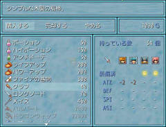
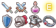
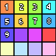

# カスタムショップステータス

- デフォルトのショップステータスウィンドウの内容を拡張します。
- ＜拡張＞ ショップコメントと併用可能
※ 多人数パーティ、装備拡張などを行うと正常に動作しません。

## スクリーンショット



※ 画像は開発中のものです。

## ダウンロード

- [＜拡張＞ ショップステータス](https://raw.githubusercontent.com/cacao-soft/RMVX/main/CustomShopStatus/ShopStatus1.rb)
- [ＫＧＣ「装備拡張」対応スクリプト](https://raw.githubusercontent.com/cacao-soft/RMVX/main/CustomShopStatus/ShopStatus1_KGC.rb)

## 使用準備

### ショップアイコン



```
ファイル名：ShopSet
フォルダ名：Graphics/System
サ  イ  ズ：96 x 48（24x24）
```

**※ 画像を使用しない設定の場合は必要ありません。**

### ショップフェイス



```
ファイル名：ShopFace
フォルダ名：Graphics/Fases
サ  イ  ズ：96 x 24~（24x24）
```

縦幅に制限はありません。並び順は、アクターＩＤで判断しています。\
**※ 画像を使用しない設定の場合は必要ありません。**
