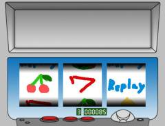
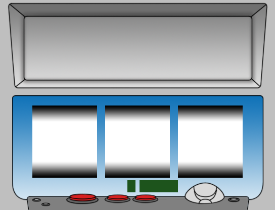
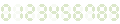

# シングルラインスロット

シングルラインスロットの機能を追加します。

## スクリーンショット



※ 画像は開発中のものです。

## ダウンロード

- [スクリプトファイル](https://github.com/cacao-soft/RMVX/raw/main/Poker.rb)

\
\


## 設定項目

### リールのシンボルの並び

```ruby
SYMBOL = {}
SYMBOL[0] = [0, 4, 3, 0, 5, 1, 4, 3, 1, 0, 2, 2, 4, 2, 1, 0]
SYMBOL[1] = [2, 1, 4, 5, 0, 4, 3, 5, 1, 2, 0, 3, 3, 2, 3, 4]
SYMBOL[2] = [3, 4, 2, 0, 3, 2, 4, 1, 5, 3, 1, 1, 4, 4, 2, 5]
```

シンボルの番号は、0～5 までです。

シンボル画像の並びに合わせて以下のような振り分けになっています。\
01\
23\
45

`SYMBOL[0]`で設定されている番号をスロット開始のラベル命令で使用します。\
`SYMBOL[3] = []`のように増やしていただければ、リールの種類を増やすことができます。

### 配当金

```ruby
WINTABLE = {
  [0,0,0] => [100, 300, 999, false],
  [1,1,1] => [ 40,  60,  80, true],
  [2,2,2] => [ 30,  40,  50, false],
  [3,3,3] => [ 20,  30,  40, false],
  [4,4,4] => [  6,  10,  15, false],
  [5,5,5] => [ 50,  75, 100, false],
  [5,5]   => [  2,   3,   4, false],
  [5]     => [  1,   2,   3, false],
}
```

`[揃えるシンボル] => [1BET, 2BET, 3BET, 再プレイ]`のように設定します。
揃えるシンボルは、数値の小さい順に並べてください。
実際に揃えるシンボルに順番は関係なく、
ここで設定されている数値と同じなら揃ったことになります。
例えば、[1,2,3] という設定で、[2,3,1] で止めた場合、この設定が揃ったことになります。

## 使用方法

### スロットを始める

イベントコマンド「ラベル」に`スロット開始：0,1,2`と記述してください。
数値は、VAR_RESULT で設定したリールの番号です。
この値を変更することで使用するリールを変更できます。
