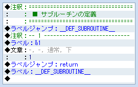
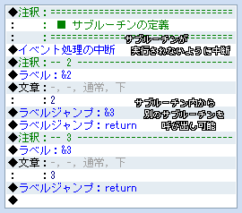
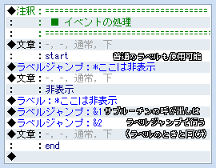

# ラベルのサブルーチン化

- 特定の「ラベル」と「ラベルジャンプ」に囲まれた部分をサブルーチンとして動作させる機能を追加します。
- 通常のラベルと違い、呼び出された位置へ自動で戻るので複数の箇所で再利用することができます。

## 注意事項

- サブルーチン化されている処理も順に実行されるためサブルーチンの処理の前に「イベント処理の中断」などを設置してください。

## スクリプト

- [ダウンロード](https://raw.githubusercontent.com/cacao-soft/RMVX/main/Subroutine.rb)

## 使用方法

### サブルーチンの定義

デフォルトの設定では、ラベル名の戦闘に`&`を付けるとサブルーチンとなります。
サブルーチンの処理の最後に「ラベルジャンプ」に`return`と記入しておきます。
この２つは、必ずセットで設定します。

サブルーチンの定義も基本的に「ラベル」と同じなので、処理が実行されないように「ラベルジャンプ」で回避するか

「イベント処理の中断」でそれ以上処理を実行しないようにしてください。

### サブルーチンの呼び出し

「ラベルジャンプ」で、サブルーチンのラベル名を記入して、ジャンプします。
この辺は、デフォルトのラベル設定と同じ方法で行います。
サブルーチン側の「ラベルジャンプ」`return`が呼び出されると、この呼び出しが行われた場所に戻り処理を再開します。

### & や return の変更

設定項目を変更することでこれらの文字は変更できます。
設定する場合は、文字列もしくは正規表現を使ってください。
