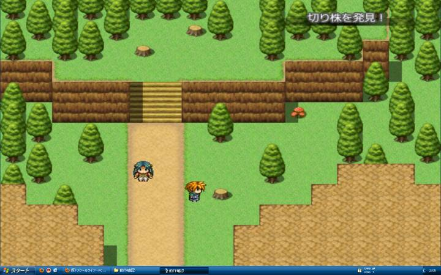

# エセフルスクリーン v1.0.x

ゲームウィンドウのサイズを解像度・800x600・フルサイズの順に変更する機能を追加します。

## スクリーンショット



※ 画像は開発中のものです。

## スクリプト

- [ダウンロード](https://raw.githubusercontent.com/cacao-soft/RMVX/0bb15ea76ae6e2bf499a7c666067a4bc3aa2eea9/wndSize.rb)

## 使用準備

### 初期化ファイルの設定

初期化ファイルの設定を使用して、初期サイズを変更する場合は[初期化ファイルの操作](https://raw.githubusercontent.com/cacao-soft/RMVX/main/ExFile.rb)スクリプトを導入し、`Game.ini`ファイルに次の３行を追加します。
```
[Window]
WIDTH=800
HEIGHT=600
```
数値部分がウィンドウのサイズとなりますので、変更してください。

初期化ファイルで設定ができるので、プレイヤーの好きなサイズで遊べるかな？と思ってたりします。その際は、サイズ変更を無効にしないと設定したサイズに戻れなくなります。

## 拡張機能

### 終了時のサイズを保存

Main セクションを以下のように変更します。
```ruby
begin
  (中略)
rescue Errno::ENOENT
  (中略)
rescue SystemExit
  $scene = nil
end

case WND_SIZE::INIT_SIZE
when 1
  r = WLIB::GetGameClientRect()
  IniFile.write("Game", "Window", "WIDTH", r.width)
  IniFile.write("Game", "Window", "HEIGHT", r.height)
when 2
  save_data(WLIB::GetGameClientRect(), "Game.rvdata")
end
```

### 切り替えサイズの変更

サイズ変更は、スクリプトの下の`Scene_Base#update`で、現在の横幅を調べて次のサイズに変更するという処理を行っています。ここの分岐を増やすなり変更すると切り替えサイズの変更が可能です。ただし、横幅しか調べてないので横幅は同じで縦幅だけ違うなんて変更はできません。`-1`というのは、フルサイズ指定してます。else のところは、変更しないようにしてください。

### 位置情報も変更

`WLIB::SetGameWindowSize`を使用すると、ウィンドウの位置は自動で中央に変更されます。位置も含めて指定したい場合は、
`WLIB::SetWindowPos(hwnd, x, y, width, height, z, flag)`を使用してください。

`WLIB::SetGameWindowSize`は、クライアント領域での設定ですが、
`WLIB::SetWindowPos`は、ウィンドウのサイズで設定する必要があります。
現在のウィンドウのサイズを取得するには、`WLIB::GetGameWindowRect`を使用します。
ちなみに、クライアント領域は、`WLIB::GetGameClientRect`です。
こちらは、サイズのみの取得ですので、プロパティ x と y は、常に 0 となります。

```
hwnd = WLIB::GAME_HANDLE
r = WLIB::GetGameWindowRect()
WLIB::SetWindowPos(hwnd, r.x, r.y, r.width, r.height, 0, WLIB::SWP_NOZORDER)
```

`WLIB::SetWindowPos`は、Win32API の関数ほぼそのままですので自動調整などは行っていません。
スクリーンの左上が (0,0) であるとは限りませんのでご注意ください。
また、現在の状態を保存して次回起動時に使用する場合なども
次もスクリーンの状態が同じとは限りません。
タスクバーの位置や解像度などに変更があると表示がおかしくなる場合があるのでご注意ください。

## 関数一覧

※ 関数形式でのみ呼び出しが可能ですので、()の省略はできません。

```
WLIB::SetGameWindowSize(width, height)
```
ウィンドウのサイズを変更します。処理に失敗した場合は、false を返します。

```
WLIB::MoveGameWindow(x, y)
```
指定座標にウィンドウを移動します。処理に失敗した場合は、false を返します。

```
WLIB::MoveGameWindowCenter()
```
画面中央にウィンドウを移動します。処理に失敗した場合は、false を返します。

```
WLIB::GetDesktopRect()
```
デスクトップの位置とサイズを取得します。処理が成功すると、Rect オブジェクトを返します。　失敗した場合は、nil が返ります。

```
WLIB::GetGameWindowRect()
```
ウィンドウの位置とサイズを取得します。処理が成功すると、Rect オブジェクトを返します。失敗した場合は、nil が返ります。

```
WLIB::GetGameClientRect()
```
ウィンドウのクライアント領域のサイズを取得します。処理が成功すると、Rect オブジェクトを返します。プロパティ x と y は、常に 0 です。失敗した場合は、nil が返ります。

```
WLIB::GetFrameSize()
```
ウィンドウのフレームサイズを取得します。処理が成功すると、[タイトルバー, 左右フレーム, 上下フレーム] を返します。
